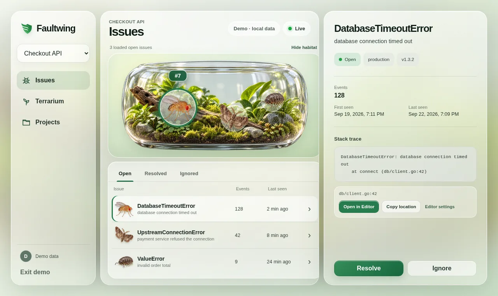

# FlyTrap

[](https://github.com/Aduneer/FlyTrap/actions/workflows/ci.yml)
[](LICENSE)

> Catch bugs before they infest production.

FlyTrap is a self-hosted error monitor built with Go, PostgreSQL, React, and a
small Python SDK. It accepts application exceptions, groups repeated errors
into issues, and turns unresolved issues into insects living in a terrarium.
The normal issue list and stack traces are still there when it is time to
debug.



_The frontend design and visual assets shown here were created with AI assistance._

> [!IMPORTANT]
> FlyTrap is an early-stage learning project. The local development workflow is
> complete, but production deployment and security hardening are not. Do not
> expose the current server directly to the public internet.

## What works

- Project-scoped event ingestion with hashed API keys
- PostgreSQL-backed background jobs with retry handling
- Error fingerprinting, grouping, occurrence counts, and monitoring metadata
- Open, resolved, and ignored issue states
- User accounts, seven-day sessions, and project ownership
- Cursor-paginated issue APIs and per-project rate limiting
- Realtime dashboard refreshes over authenticated WebSockets
- Responsive issue dashboard and terrarium, including a local demo mode
- Stack-frame links for VS Code, Cursor, Zed, and JetBrains IDEs
- A dependency-free Python client and fake-error generator

## Quick start

### Requirements

- Go 1.27.1
- Docker with Docker Compose
- Node.js 26 and npm 12
- Python 3.10 or newer if you want to use the SDK or error generator

Clone the repository and start PostgreSQL:

```bash
git clone https://github.com/Aduneer/FlyTrap.git
cd FlyTrap
make db-up
```

Start the API, worker, and frontend in separate terminals:

```bash
make run
```

```bash
make run-worker
```

```bash
make frontend-install
make frontend-dev
```

Open <http://127.0.0.1:5173>. Register an account, create a project, and save
the API key shown after project creation; the plaintext key is returned only
once.

The API applies embedded SQL migrations automatically when it starts. The
development defaults match `docker-compose.yml`, so no environment variables
are required for this local setup.

### Explore without an API

Choose **Explore the interactive demo** on the welcome screen. Demo data stays
inside the browser and is clearly labelled; it is not sent to the backend.

### Send a Python exception

Install the local SDK:

```bash
python3 -m venv .venv
source .venv/bin/activate
python -m pip install -e sdk/python
```

Then use the API key from your project:

```python
from flytrap import FlyTrap

flytrap = FlyTrap(
    "http://localhost:8080",
    "fly_your_api_key",
    environment="development",
    release="0.1.0",
)

try:
    raise RuntimeError("the example service stopped responding")
except RuntimeError as error:
    flytrap.capture_exception(error)
```

Or generate a small batch of sample errors:

```bash
FLYTRAP_API_KEY=fly_your_api_key make generate-errors \
  ARGS="--count 10 --delay 0.1"
```

The API returns `202 Accepted` after persisting an event job. The worker must
be running for that job to become an issue in the dashboard.

## How it works

```text
Application / Python SDK
          │
          │ POST /api/v1/events + project API key
          ▼
       Go API ───────► PostgreSQL event_jobs
                            │
                            ▼
                        Go worker
                            │ fingerprint + aggregate
                            ▼
                  PostgreSQL issues/events
                            │ NOTIFY
                            ▼
       React dashboard ◄── Go API / WebSocket
```

PostgreSQL is both the system of record and the durable job queue. Workers use
`FOR UPDATE SKIP LOCKED`, so more than one worker can safely claim available
jobs. Successful processing updates an issue and publishes a lightweight
notification; dashboard clients then refetch authoritative data from the API.

See [the architecture guide](docs/architecture.md) for component boundaries
and failure behavior, [the API guide](docs/api.md) for HTTP examples, and
[the frontend guide](docs/frontend.md) for browser and editor integration.

## Configuration

| Variable | Default | Purpose |
| --- | --- | --- |
| `HTTP_ADDR` | `:8080` | API listen address |
| `DATABASE_URL` | local `flytrap` PostgreSQL URL | PostgreSQL connection string |
| `EVENT_RATE_LIMIT_PER_MINUTE` | `60` | Sustained ingestion limit per project |
| `EVENT_RATE_LIMIT_BURST` | `10` | Additional per-project burst capacity |

Copy `.env.example` when you need a reference, but note that FlyTrap reads
environment variables directly; it does not load `.env` files itself.

## Development

Run the checks used during local development:

```bash
make test
make test-integration
make test-python
make frontend-build
make frontend-test
```

The integration tests expect the Compose database by default. Playwright needs
Chromium installed once:

```bash
cd web
npx playwright install chromium
```

CI checks Go formatting, Go tests and vet, database integration flows, the
Python SDK, the frontend production build, and Playwright behavior on desktop
and mobile viewports.

## Repository layout

```text
cmd/api/          API process
cmd/worker/       background event worker
internal/         Go application packages
migrations/       embedded, ordered SQL migrations
sdk/python/       Python client package
web/              React/Vite dashboard
docs/             API, architecture, and frontend notes
scripts/          local development utilities
```

## Security notes

- Project API keys and dashboard session tokens are stored as SHA-256 hashes;
  user passwords are stored with bcrypt.
- Local editor source roots are kept in browser storage and are not sent to
  the FlyTrap API.
- Credentials in `docker-compose.yml` and `.env.example` are development-only
  defaults. Replace them before any non-local deployment.
- FlyTrap has not received a production security audit and does not yet ship
  TLS termination, hardened deployment manifests, backups, or retention
  controls.

## Project status

The initial backend and frontend feature set is complete. The next milestone
is a documented deployment path: production containers, reverse-proxy/TLS
guidance, secret management, backups, and operational hardening.

This started as a backend engineering learning project. The frontend was
implemented with substantial AI assistance and is disclosed as such; the
backend and documentation remain intended to be understandable, testable, and
useful to people learning from the repository.

[Bug reports](https://github.com/Aduneer/FlyTrap/issues) and contributions are
welcome. Please read [CONTRIBUTING.md](CONTRIBUTING.md) before opening a larger
change.

## License

FlyTrap is available under the [MIT License](LICENSE).
